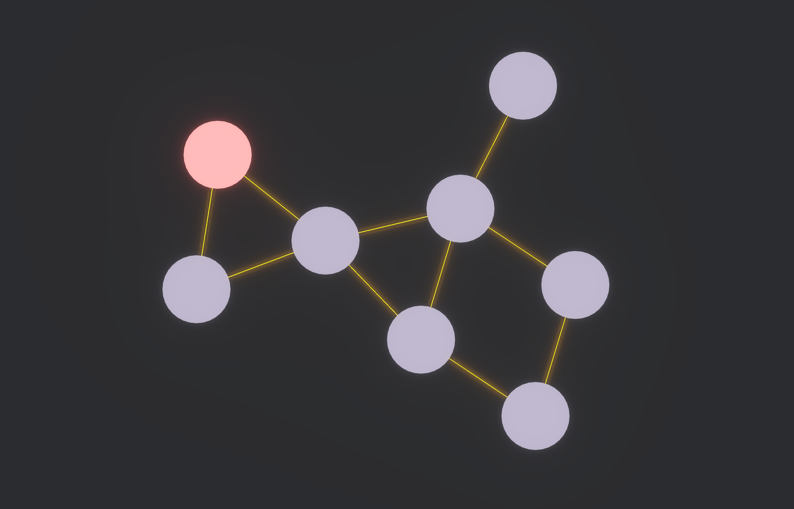

# Graphified Intelligence System [WIP]

This is going to be a game about graph puzzles, originally inspired by [TIS-100](https://store.steampowered.com/app/370360/TIS100/). The exact gameplay is not finalized, but the goal is to feature a variety of levels with different goals and tools, maybe in the essence of how [Baba is You](https://store.steampowered.com/app/736260/Baba_Is_You/) varies the gameplay by allowing different tools and modifications in different levels.

